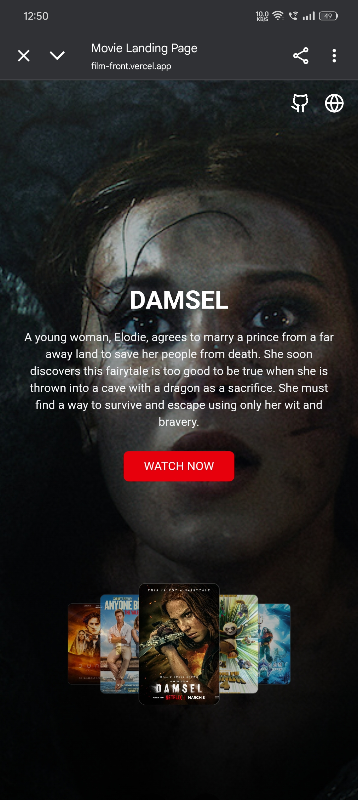
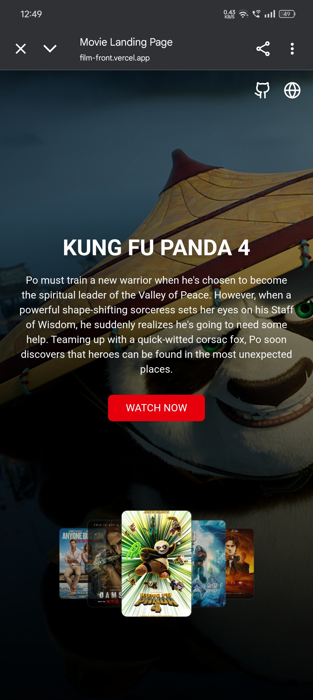

# Movie Landing Page
Film-Front is a responsive movie landing page built with React, Tailwind CSS, and Vite. It features a dynamic 3D poster carousel, and clean responsive design for both desktop and mobile. Perfect for showcasing a curated selection of movies with modern UI effects.
<div align="center">

[](https://film-front.vercel.app/)
[](https://hub.docker.com/r/dheerajchintala/film-front)

</div>


---
### Screenshots
| Web View | Mobile View|
|----------|------------|
|  |  |
|  |  |

---

## Archietecture

```mermaid
flowchart LR

    subgraph Developer
        A1[React Code]
        A2[Push to GitHub]
    end

    subgraph GitHub
        B1[Repository]
        B2[GitHub Actions Pipeline]
    end

    subgraph Build
        C1[Dockerfile: Node to Nginx]
        C2[Build React App]
        C3[Create Nginx Image]
    end

    subgraph DockerHub
        D1[film-front:latest]
    end

    subgraph Live
        E1[Nginx Container]
        E2[Public URL]
    end

    A1 --> A2
    A2 --> B1
    B1 --> B2
    B2 --> C1
    C1 --> C2
    C2 --> C3
    C3 -->|Push Image| D1
    D1 -->|Pull Image| E1
    E1 --> E2

```



##  Deployment

This project is deployed in two ways:


###  1. Live Deployment (Vercel)
The production build is hosted on **Vercel** for fast, globally distributed static hosting.

🔗 **Live URL:** https://film-front.vercel.app/


###  2. Docker Deployment (Nginx + Docker)
A production-ready Docker image is available on Docker Hub.  
It includes a multi-stage build (Node → Nginx) with optimized static assets.

#### Pull the Docker Image
```bash
docker pull dheerajchintala/film-front:latest
```
#### Run the container
``` bash
docker run -p 3000:80 dheerajchintala/film-front
```
#### Now open http://localhost:3000

